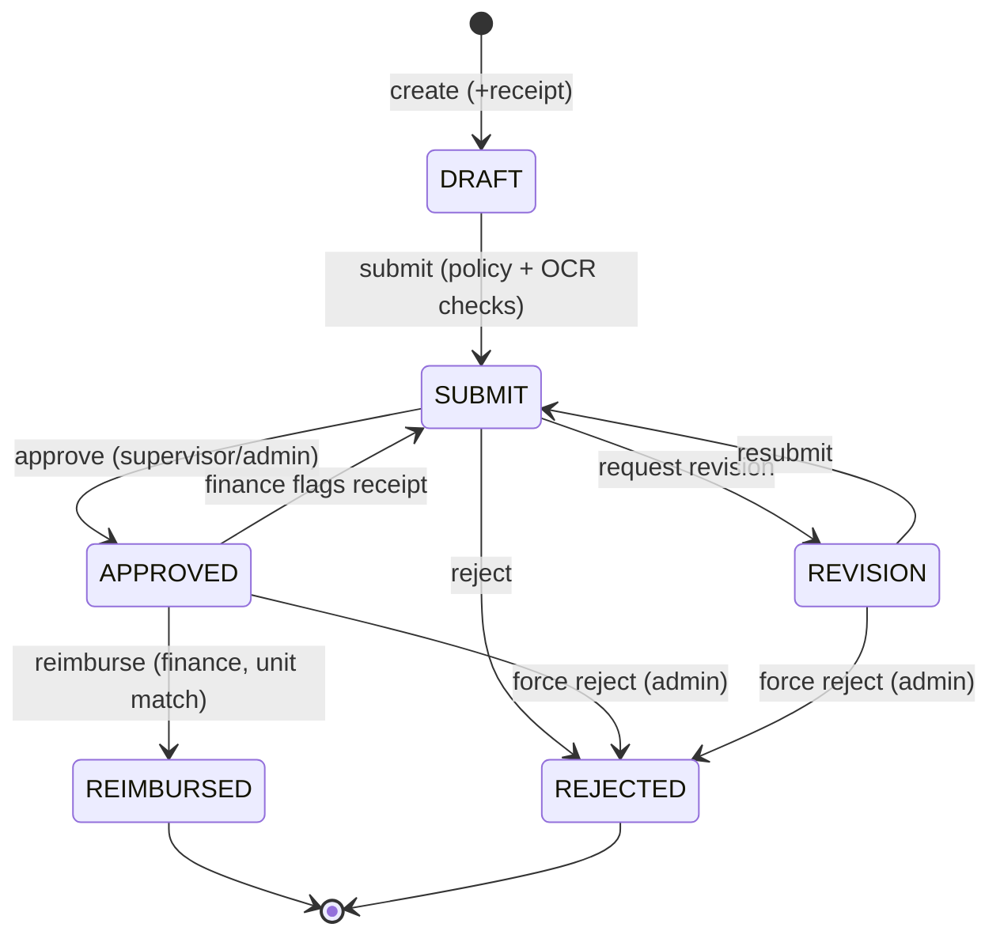

# Imbursare

**A multi-tenant expense reimbursement platform with a role-based approval workflow, spending policies, an immutable audit trail, and AI-assisted receipt validation.**

Employees submit expenses with receipts; supervisors approve, reject, or send them back for revision; finance reimburses. Every attachment is scanned with OCR and the declared amount is reconciled against the receipt total at submit time. Built as a production-minded full-stack portfolio project.

---

## Table of contents

- [Highlights](#highlights)
- [Tech stack](#tech-stack)
- [Architecture](#architecture)
- [Data model](#data-model)
- [Roles & permissions](#roles--permissions)
- [Expense lifecycle](#expense-lifecycle)
- [OCR receipt validation](#ocr-receipt-validation)
- [Getting started](#getting-started)
- [Environment variables](#environment-variables)
- [API reference](#api-reference)
- [Security notes](#security-notes)
- [Deployment](#deployment)
- [Known limitations / roadmap](#known-limitations--roadmap)

---

## Highlights

- **Role-based access control** — `EMPLOYEE`, `FINANCE`, `ADMIN` enforced per company via NestJS guards + a role decorator, with the caller's role resolved **live** from their membership on every request (a demotion or removal takes effect immediately, not at token expiry).
- **Multi-step approval workflow** — `DRAFT → SUBMIT → APPROVED → REIMBURSED`, plus `REVISION` (sent back to the employee) and `REJECTED`, each transition written to an immutable audit log.
- **Org hierarchy** — self-referential `Employee` supervisor/subordinate tree; an expense's approver is the submitter's supervisor (falling back to a company admin).
- **Spending policies** — per position-level `AmountPolicy` caps both the per-transaction amount and the number of concurrently active transactions.
- **AI receipt validation** — receipts are OCR'd (Groq vision / PDF models); at submit the declared amount is reconciled against the scanned total (over-claims beyond 5% are blocked) and each receipt is stamped `VALID` / `INVALID` / `UNVERIFIED`.
- **Secure file uploads** — attachments live on Cloudflare R2 and are served to the client through short-lived presigned URLs.
- **Invite-based onboarding** — admins invite employees via a single-use, expiring link (no passwords are generated or shared); plus self-service forgot-password and change-password. Tokens are stored hashed and are single-use.
- **Multi-tenant** — one platform, many companies, each with isolated data.
- **Server-side pagination, search & filtering** on every list, with per-status counts and amount totals computed in a single query.

## Tech stack

| Layer | Technology |
|---|---|
| **API** | NestJS 11, Prisma 6, PostgreSQL, Passport JWT, class-validator |
| **Web** | Next.js 16 (App Router), React 19, Tailwind CSS 4, shadcn/ui |
| **Storage** | Cloudflare R2 (S3-compatible) via AWS SDK v3 + presigned URLs |
| **OCR** | Groq — `llama-4-scout` (image vision) and `llama-3.3-70b` + `pdf-parse` (PDF) |
| **Auth** | JWT (1-day expiry), bcrypt password hashing |

## Architecture

Monorepo with two apps:

```
Imbursare/
├── apps/
│   ├── api/                     # NestJS backend
│   │   ├── prisma/
│   │   │   ├── schema.prisma     # data model
│   │   │   └── migrations/       # SQL migration history
│   │   └── src/
│   │       ├── auth/             # JWT strategy, guards, roles decorator
│   │       ├── company/          # companies, employees, memberships
│   │       ├── expense/          # core workflow + OCR validation
│   │       ├── category/         # expense categories
│   │       ├── position-level/   # job positions & levels
│   │       ├── amount-policy/    # per-level spending policies
│   │       ├── storage/          # R2 client, upload & presign helpers
│   │       └── user/             # user profile
│   └── web/                      # Next.js frontend
│       └── src/
│           ├── app/(auth)/        # login, register
│           ├── app/(dashboard)/   # dashboard, expenses, approvals, admin, finance
│           ├── components/ui/     # shared UI (badges, cards, pagination…)
│           └── lib/               # api client + auth helpers
```

**Request flow:** the browser calls the API with a Bearer JWT → `JwtAuthGuard` validates the token and resolves the live role/membership → `RolesGuard` enforces the route's required roles → the service layer additionally scopes every query by `companyId` and re-checks ownership/role.

## Data model

Core Prisma models:

| Model | Purpose |
|---|---|
| **Company** | Top-level tenant; owns positions, categories, employees, expenses, policies. |
| **User** | Global account (email + hashed password); joins companies via memberships. |
| **Membership** | `User ↔ Company` join carrying the per-company `CompanyRole`. |
| **Employee** | Per-company profile (name, unit, phone, address); self-referential supervisor tree; linked to a `Position`. |
| **Position** | Job title with an integer `level` that drives policy enforcement. |
| **AmountPolicy** | Per-level rule: `maxAmount` (per transaction) + `totalTransactions` (active cap). |
| **Category** | Company-scoped expense category. |
| **Expense** | Core entity: title, description, amount, unit, status, `expenseNumber`, approver/reimburser + timestamps. |
| **ExpenseApproval** | One approver per expense with `ApprovalStatus` + note. |
| **ExpenseAttachment** | Receipt metadata (name, URL, type, size) + `ocrStatus` / `ocrAmount`. |
| **ExpenseLog** | Immutable audit record of every status transition (actor + message). |
| **PasswordToken** | Single-use, expiring token (stored hashed) backing the invite and password-reset flows. |

**Enums:** `CompanyRole (EMPLOYEE | FINANCE | ADMIN)`, `ExpenseStatus (DRAFT | SUBMIT | APPROVED | REJECTED | REIMBURSED | REVISION)`, `ApprovalStatus (PENDING | APPROVED | REJECTED)`, `OcrStatus (VALID | INVALID | UNVERIFIED)`, `PasswordTokenPurpose (INVITE | RESET)`.

## Roles & permissions

| Capability | EMPLOYEE | FINANCE | ADMIN |
|---|:--:|:--:|:--:|
| Create / edit / submit own expenses | ✅ | ✅ | ✅ |
| Approve / reject / request revision (as assigned supervisor) | ✅¹ | ✅¹ | ✅ |
| View own company's expenses (all) | — | — | ✅ |
| View own unit's approved/reimbursed expenses | — | ✅ | — |
| Reimburse (own unit) / flag receipt back to supervisor | — | ✅ | — |
| Force-reject any non-terminal expense | — | — | ✅ |
| Manage employees, positions, categories, policies | — | ✅² | ✅ |

¹ Only for expenses where they are the assigned approver. ² Finance can manage positions/categories/policies; only admins add users and edit employees.

## Expense lifecycle



- **Create** requires at least one attachment (image / PDF / DOCX, ≤ 4 MB) and derives the `unit` from the employee.
- **Submit** enforces the position-level `AmountPolicy` (per-transaction cap + active-transaction cap), assigns the approver, generates a unique `expenseNumber` (`EXP/{UNIT}/{YEAR}/0001`), and runs OCR reconciliation.
- Every transition appends an `ExpenseLog` entry; the approver identity is tracked in `ExpenseApproval`.

## OCR receipt validation

At **submit** time the API re-scans the stored receipts (not client-supplied data) and:

1. **Amount reconciliation** — sums the OCR-read amounts and **blocks the submit** if the declared amount exceeds the receipt total by more than **5%** (`OCR_TOLERANCE`). Claiming equal or less always passes.
2. **Per-receipt status** — each attachment is stamped:
   - `VALID` — recognised as a genuine receipt with a readable amount,
   - `INVALID` — not recognised as a receipt (warn-only; does not block),
   - `UNVERIFIED` — unreadable, a non-scannable file type, or OCR was unavailable.
3. **Fail-open** — OCR/storage/Groq errors never block the workflow; they resolve to `UNVERIFIED` and are logged.

The result is surfaced as an aggregated badge on the admin / finance / approver tables and per-receipt on the expense detail page. On the "new expense" form, uploading a receipt auto-fills the title and amount, and warns before submit if you over-claim or attach a non-receipt.

## Getting started

### Prerequisites

- Node.js 18+ and npm
- A PostgreSQL database (local or hosted, e.g. [Neon](https://neon.tech))
- A Cloudflare R2 bucket + API token (for attachments)
- A [Groq](https://console.groq.com) API key (for OCR; optional — without it, receipts are simply marked `UNVERIFIED`)

### 1. Install

```bash
git clone https://github.com/DityaIlhami28/Imbursare.git
cd Imbursare
npm --prefix apps/api install
npm --prefix apps/web install
```

### 2. Configure environment

Create `apps/api/.env` and `apps/web/.env.local` — see [Environment variables](#environment-variables).

### 3. Set up the database

```bash
cd apps/api
npx prisma migrate deploy   # apply migrations
npx prisma generate         # generate the client
```

### 4. Run (development)

From the repo root:

```bash
npm run dev        # launches API (:3000) and web (:3001) in separate terminals
# or individually:
npm run dev:api    # NestJS on http://localhost:3000
npm run dev:web    # Next.js on http://localhost:3001
```

Open **http://localhost:3001**, register an account, create a company (you become its admin), then add positions, categories, an amount policy, and employees before submitting expenses.

## Environment variables

**`apps/api/.env`**

| Variable | Description |
|---|---|
| `DATABASE_URL` | PostgreSQL connection string. |
| `JWT_SECRET` | Secret for signing JWTs — **set a strong random value in production**. |
| `CORS_ORIGIN` | Allowed web origin (defaults to `http://localhost:3001`). |
| `PORT` | API port (defaults to `3000`). |
| `GROQ_API_KEY` | Groq key for OCR (optional). |
| `R2_ENDPOINT` | R2 S3 API endpoint. |
| `R2_ACCESS_KEY_ID` / `R2_SECRET_ACCESS_KEY` | R2 credentials. |
| `R2_BUCKET_NAME` | R2 bucket name. |
| `R2_PUBLIC_URL` | Base URL used to derive object keys / build URLs. |
| `APP_URL` | Web app base URL used to build invite/reset links (falls back to `CORS_ORIGIN`, then `http://localhost:3001`). |

**`apps/web/.env.local`**

| Variable | Description |
|---|---|
| `NEXT_PUBLIC_API_URL` | Base URL of the API (defaults to `http://localhost:3000`). |

## API reference

Base URL: `http://localhost:3000`. All endpoints except `POST /auth/register` and `POST /auth/login` require an `Authorization: Bearer <token>` header. Role-restricted endpoints are noted; unmarked authenticated endpoints are available to any member of the company.

### Auth

| Method | Path | Body | Description |
|---|---|---|---|
| `POST` | `/auth/register` | `{ email, password }` | Create a global user account. |
| `POST` | `/auth/login` | `{ email, password }` | Returns `{ access_token }` (JWT carries `sub`, `email`, `companyId?`, `role?`). |
| `POST` | `/auth/forgot-password` | `{ email }` | Issue a reset link. Always returns the same message (never reveals whether the email exists). |
| `POST` | `/auth/reset-password` | `{ token, password }` | Consume an invite/reset token and set a new password (activates pending accounts). |
| `PATCH` | `/auth/change-password` | `{ currentPassword, newPassword }` | Change the current user's password (authenticated). |

### User

| Method | Path | Description |
|---|---|---|
| `GET` | `/user/profile` | Current user's `{ email, company, role }`. |

### Company & employees

| Method | Path | Role | Body | Description |
|---|---|---|---|---|
| `POST` | `/company` | any | `{ name }` | Create a company (caller becomes its admin). Re-login to refresh the JWT with the new company context. |
| `POST` | `/company/add-user` | ADMIN | `{ fullName, email, role }` | Provision a user + employee + membership in the company. |
| `GET` | `/company/employees` | ADMIN, FINANCE | — | List employees. |
| `GET` | `/company/employee/:id` | any | — | Employee detail (position, unit, supervisor, subordinates). |
| `PATCH` | `/company/employee/:id` | ADMIN | partial employee | Update position, unit, supervisor, etc. |

### Categories

| Method | Path | Role | Body | Description |
|---|---|---|---|---|
| `POST` | `/category/add-category` | ADMIN, FINANCE | `{ name }` | Create a category. |
| `GET` | `/category/get-categories` | any | — | List categories. |

### Positions

| Method | Path | Role | Body | Description |
|---|---|---|---|---|
| `GET` | `/positions` | ADMIN, FINANCE | — | List positions. |
| `POST` | `/positions/create-position` | ADMIN, FINANCE | `{ name, positionLevel }` | Create a position with a level. |
| `GET` | `/positions/:id` | ADMIN, FINANCE | — | Position detail + its employees. |

### Amount policies

| Method | Path | Role | Body | Description |
|---|---|---|---|---|
| `GET` | `/amount-policy` | ADMIN, FINANCE | — | List policies. |
| `POST` | `/amount-policy/create-amount-policy` | ADMIN, FINANCE | `{ maxAmount, positionLevel, totalTransactions }` | Create a per-level spending policy. |

### Expenses

List endpoints marked **paged** accept query params `?page=&pageSize=&search=&status=` and return
`{ data: [...], total, statusCounts: { [status]: n }, statusSums: { [status]: amount } }`.
Omitting `page`/`pageSize` returns the full list (used by the dashboard).

| Method | Path | Role | Description |
|---|---|---|---|
| `POST` | `/expense/create-expense` | any | Multipart: `title`, `description`, `amount`, `category` + up to 5 `files`. Creates a `DRAFT`. |
| `GET` | `/expense/my-expenses` | any | **Paged.** The caller's own expenses. |
| `GET` | `/expense/company-expenses-for-admin` | ADMIN | **Paged.** All company expenses. |
| `GET` | `/expense/company-expenses-for-finance` | FINANCE | **Paged.** Unit's `APPROVED`/`REIMBURSED` expenses. |
| `GET` | `/expense/pending-approvals` | any | Pending approvals assigned to the caller. |
| `GET` | `/expense/all-approvals` | any | **Paged.** All approvals assigned to the caller (any status). |
| `GET` | `/expense/:id` | any¹ | Expense detail with presigned attachment URLs + OCR status. |
| `GET` | `/expense/logs/:id` | any¹ | Chronological audit log for an expense. |
| `PATCH` | `/expense/:id` | owner | Multipart edit (`DRAFT`/`REVISION` only); supports adding files and `removeAttachmentIds`. |
| `PATCH` | `/expense/:id/submit` | owner | Submit for approval (runs policy + OCR checks). |
| `PATCH` | `/expense/:id/approve` | approver/ADMIN | `{ note? }` — approve a `SUBMIT` expense. |
| `PATCH` | `/expense/:id/reject` | approver/ADMIN | `{ note? }` — reject a `SUBMIT` expense. |
| `PATCH` | `/expense/:id/revision` | approver/ADMIN | `{ note }` — send back to the employee. |
| `PATCH` | `/expense/:id/finance-reject` | FINANCE | `{ note }` — send an `APPROVED` expense back to the supervisor. |
| `PATCH` | `/expense/:id/reimburse` | FINANCE | Mark an `APPROVED` expense (same unit) as `REIMBURSED`. |
| `PATCH` | `/expense/:id/force-reject` | ADMIN | `{ note }` — reject from any non-terminal state. |
| `GET` | `/expense/:id/scan-attachments` | any¹ | Re-run OCR over the stored receipts; returns `{ title, amount }`. |
| `POST` | `/expense/scan-receipt` | any | Multipart single `file`; OCR a receipt and return `{ title, amount, isReceipt }`. |

¹ Visibility is gated to the owner, an admin, finance in the same unit, or the assigned approver.

## Security notes

- **Multi-tenant isolation** — every query is scoped by `companyId`; expense detail/logs are additionally gated to the people with a reason to see them.
- **Live authorization** — role is resolved from the DB on each request, so revoked/demoted access is effective immediately (tokens still expire after 1 day as a backstop).
- **Presigned uploads** — receipts are returned as short-lived (1 h) presigned URLs; set the R2 bucket to private and allow your web origin in the bucket's CORS for the URLs to render in the browser.
- **Input validation** — a global `ValidationPipe` (whitelist + forbid-unknown) plus typed DTOs; the create/update paths validate amounts as positive numbers.
- **Concurrency-safe numbering** — a `@@unique([companyId, expenseNumber])` constraint plus a retry loop prevents duplicate expense numbers under concurrent submits.


## Known limitations / roadmap

- **Company switching** — a user is pinned to their first company membership at login; switching companies (a token re-issue endpoint + a company picker) is not yet implemented.
- **Money type** — amounts are stored as `Float`. This is exact for whole-rupiah (IDR) values, but a move to integer/`Decimal` would be needed to support fractional currencies.
- **Notifications** — approvals and revisions are surfaced in-app only; email/push notifications are a natural next step.
- **Email delivery** — invite and password-reset emails currently log the link to the server console (a dev fallback). `MailService` is the single swap point for a real provider (Resend/SendGrid/SMTP); the admin "add employee" screen also surfaces the invite link directly.
